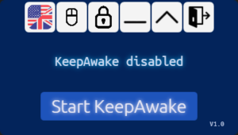

# KeepAwake

## Introduction
KeepAwake is a mouse movement and activity simulator to prevent a screensaver or inactivity timeout in a Windows OS based system

## KeepAwake Installation
- KeepAwake needs [.NET 8.0](https://dotnet.microsoft.com/en-us/download/dotnet/8.0) (either as Runtime or SDK)
- In case the KeepAwake EXE is build as _Standalone_ version no additional [.NET 8.0](https://dotnet.microsoft.com/en-us/download/dotnet/8.0) is needed
- The KeepAwake EXE itself can be run from every local folder without installation

## Manual

### UI screenshot

### KeepAwake is controlled with the following buttons:

| _Button_ | _Action_ |
|:----:|:----:|
|  | switch UI language |
|  | enable/disable additional mouse movement |
|  | enable/disable KeepAwake stay-on-top mode |
|  | minimize to taskbar |
|  | enable/disable fullscreen mode |
|  | exit KeepAwake |
|  | start/stop activity simulation |

## License / Copyright
KeepAwake is licensed under [GPL-2.0-only](./LICENSE).

© Alexander Feuster 2024
